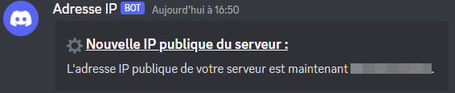

  <h3 align="center">See IP 👀</h3>

  

Toutes les 60 secondes le programme va chercher si l'IP publique du réseau à changer. Si il à changer alors il envoie un embed.
    
 

## 📷 Images 

  

## ⚙️ How-To setup 
## 📚 Useful functions 

